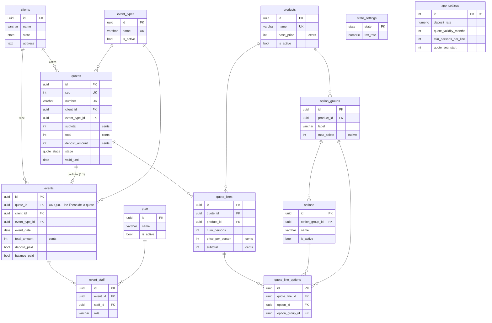

# Mach Bar — Modelo de datos y flujos (refinado)

> Refinamiento del `mach-bar-specs.md` original, enfocado en **modelo de datos** y **flujos de front**.
> La **arquitectura** (cómo se construye) NO se repite acá: manda `docs/backend/architecture.md`
> y `docs/frontend/architecture.md`. Este doc describe **qué** se construye (el dominio).
>
> Diagrama ER: `docs/mach-bar-model.dbml` (pegar en [dbdiagram.io](https://dbdiagram.io)) + Mermaid abajo.

---

## 1. Propósito y alcance

Mach Bar es un servicio de **estaciones de comida/bebida para eventos** (Crepaletas, Crepes, Mini
Pancakes, Nachos, Fruit Station, Esquites, Snack Station, Popsicles, Craft Bar) en NY/NJ/CT. Este
portal (Fase 1) es la **herramienta interna** que reemplaza el seguimiento manual en Excel.

El objeto central es la **cotización**: un documento con N estaciones, cada una con nº de personas,
precio/persona e ingredientes elegidos de un catálogo. Cuando se aprueba, la cotización **se
convierte en evento**, y al evento se le asigna staff. El PDF de la cotización lo genera un
**microservicio serverless en Go** (§12).

Tres clusters de datos: **comercial** (`clients → quotes → …`), **operación** (`events → …`, `staff`),
**catálogo** (`products → option_groups → options`), más **configuración**.

> **Nombres genéricos** (para reuso en otros negocios del giro). Mach Bar los muestra vía i18n:
> `product` → "Estación", `option_group` → "Sección", `option` → "Ítem". El schema es genérico;
> la marca la ponen las etiquetas.

---

## 2. Decisiones de diseño (log)

| # | Decisión | Motivo |
|---|---|---|
| D1 | **Un solo eje de estado**: `quotes.stage` (`new/quoted/confirmed/completed/cancelled`). Se elimina el `status` del spec. | El spec tenía doble máquina de estados (`status` + `pipelineStage`) solapada y desincronizable. |
| D2 | **La cotización ES la oportunidad** del pipeline (una card del kanban = una quote). | Un cliente puede pedir varios eventos → varias quotes = varias cards. |
| D3 | **`clients.status` (lead/active) es derivado**, no columna. | *active* = tiene ≥1 quote confirmed/completed; si no, *lead*. Menos campos que mantener. |
| D4 | **El evento nace SIEMPRE de una quote confirmada.** No hay creación manual. | Permite eliminar `events.status` (lo lleva `quote.stage`). |
| D5 | **`events.status` y `events.month` se eliminan** (derivados de `quote.stage` y `event_date`). | `month` en español era frágil (locale, sin año, redundante). |
| D6 | **Ingredientes solo viven en la quote** (no se copian al evento). El catálogo usa **soft-delete** (`is_active`). | La operación consulta la quote/PDF vía `event.quote_id`; el soft-delete evita romper quotes históricas. |
| D7 | **Dinero en centavos (`integer`)**; tasas en `numeric`. | Float rompe decimales (`0.1+0.2≠0.3`); enteros son exactos. Ver §3. |
| D8 | **Precio**: subtotal − descuento (fijo o %) → +impuesto → total → depósito. Descuento **antes** de impuesto. | Cascada estándar de factura. Ver §7. |
| D9 | **Tasas configurables** en un módulo de config; **snapshot** en la quote al calcular. | Cambiar una tasa no debe recalcular quotes históricas. |
| D10 | **Sin `travel_fee`** por ahora (columna futura en `state_settings`). | El negocio no lo usa aún. |
| D11 | **Número de quote** `quoYYYYMMDD-NNNNNN` con consecutivo global; inicio configurable con validación `≥ último usado`. | — |
| D12 | **PDF**: la API arma un **payload denormalizado** y lo POSTea al micro Go, que devuelve URL. | Micro stateless, PDF idéntico al preview, sin acoplar a la DB. |
| D13 | **El evento NO copia su composición**: lee sus líneas y opciones de la quote (`event.quote_id`). Se **elimina la copia** (`event_lines`). | El evento se ejecuta exacto a lo cotizado; la quote es read-only tras `confirmed` → una sola fuente de verdad (coherente con D6). |
| D14 | **`event_type` es una tabla** (`event_types`), no un varchar. `quotes`/`events` la referencian por FK (`event_type_id`), con soft-delete. | Tipos de evento consistentes y administrables (evita texto libre duplicado). |
| D15 | **Nombres genéricos** del catálogo: `stations→products`, `station_sections→option_groups`, `station_items→options`, `quote_stations→quote_lines`, `quote_station_selections→quote_line_options`. Etiquetas Mach Bar por i18n. | Reuso en otros negocios del giro sin atar el schema a su jerga (patrón Producto→Grupo de opciones→Opción, **no** *variants*). Multi-tenant queda como futuro aditivo (sin `tenant_id` aún). |
| — | **Templates de textos del PDF**: PAUSADO. | Se retoma más adelante. |

---

## 3. Regla transversal — dinero en centavos

**Todo monto se guarda y se calcula como entero de centavos.** El punto decimal no existe en el
dato; es solo forma de mostrar.

- **Guardar/calcular**: `integer` (cents). `$785.00 → 78500`.
- **Mostrar** (cents → USD): `/100` solo en el FE, en un helper `formatMoney(cents)`.
- **Leer input** (USD → cents): `Math.round(valor * 100)` solo al capturar del form.
- **Entre esas fronteras, todo es entero.** Nunca se divide en el medio.
- **Tasas** (`tax_rate 0.08875`, `deposit_rate 0.5`, descuento %) van `numeric`. Al multiplicar
  `entero × tasa`, se **redondea explícito** a centavo entero (`Math.round`). Ese redondeo controlado
  es lo que float no permite.

---

## 4. Enums

```ts
export const stateEnum         = pgEnum('state', ['NY', 'NJ', 'CT']);
export const quoteStageEnum    = pgEnum('quote_stage', ['new', 'quoted', 'confirmed', 'completed', 'cancelled']);
export const discountTypeEnum  = pgEnum('discount_type', ['fixed', 'percent']);
export const paymentMethodEnum = pgEnum('payment_method', ['zelle', 'cash', 'card', 'check']);
```

Eliminados del spec: `client_status` (derivado), `quote_status` (fusionado en `quote_stage`),
`pipeline_stage` (es `quote_stage`), `event_status` (derivado).

---

## 5. Modelo de datos

Ilustrativo en Drizzle; la definición final vive en `apps/api/src/db/schema/` (ver
`docs/backend/architecture.md §8`). `money = integer` (cents).

### 5.1 Comercial

```ts
// clients — status (lead|active) es DERIVADO en el resource, no columna.
clients {
  id, name*, phone, email, city, state, address, notes, createdAt, updatedAt
}

// quotes — la cotización = la oportunidad del pipeline.
quotes {
  id,
  seq*         integer unique,        // consecutivo global (arranca en app_settings.quoteSeqStart)
  number*      varchar unique,        // 'quoYYYYMMDD-NNNNNN'
  clientId*    -> clients.id,
  eventTypeId  -> event_types.id, eventDate, eventTime, state, address,
  // precio (todo cents salvo *_rate):
  subtotal*        integer,           // Σ quote_lines.subtotal
  discountType     discount_type?,    // fixed | percent
  discountValue    numeric?,          // % o cents según type
  discountAmount*  integer,           // resuelto
  taxRate*         numeric,           // snapshot de state_settings
  taxAmount*       integer,
  total*           integer,
  depositRate*     numeric default 0.5,
  depositAmount*   integer,
  notes,
  stage*       quote_stage default 'new',
  validUntil   date,                  // createdAt + config.quoteValidityMonths
  createdAt, updatedAt
}
// balance = total - depositAmount (derivado)

quote_lines {
  id, quoteId* -> quotes (cascade), productId* -> products,
  numPersons*  integer,               // min = config.minPersonsPerLine
  pricePerPerson* integer,            // cents, snapshot del catálogo
  subtotal*    integer,               // cents
  sortOrder
}

quote_line_options {
  id, quoteLineId* -> quote_lines (cascade),
  optionId* -> options, optionGroupId* -> option_groups
}
```

### 5.2 Operación

```ts
events {
  id,
  quoteId*  -> quotes UNIQUE,         // 1 evento por quote (nace de confirmar)
  clientId* -> clients,
  eventTypeId -> event_types.id, eventDate*, eventTime, state*, address*,
  totalAmount* integer,               // cents, snapshot de quote.total
  depositPaid* boolean, balancePaid* boolean, paymentMethod,
  notes, createdAt, updatedAt
}
// status y month son DERIVADOS (quote.stage / eventDate)
// líneas (products) y opciones se LEEN de la quote (quoteId); no se copian (D13)

event_staff {
  id, eventId* -> events (cascade), staffId* -> staff, role, assignedAt
  // unique(eventId, staffId)
}

staff { id, name*, phone, email, isActive* default true, createdAt }
```

### 5.3 Catálogo maestro (soft-delete)

Etiquetas i18n en Mach Bar: `product` = "Estación", `option_group` = "Sección", `option` = "Ítem".

```ts
products {
  id, name* unique, description,
  basePrice* integer,                 // cents, precio/persona (prefill del builder)
  isPremium* default false, isActive* default true, sortOrder
}
option_groups {
  id, productId* -> products (cascade), label*,
  maxSelect integer,                  // null = sin límite
  isActive* default true, sortOrder
}
options {
  id, optionGroupId* -> option_groups (cascade), name*,
  isActive* default true,             // soft-delete: lo referencian quote_line_options
  sortOrder
}

// event_types — lookup de tipos de evento (Boda, Cumpleaños, Corporativo…)
event_types {
  id, name* unique,
  isActive* default true,             // soft-delete: lo referencian quotes/events
  sortOrder
}
```

### 5.4 Configuración

```ts
state_settings {                      // una fila por estado (seed NY/NJ/CT)
  state* PK, taxRate* numeric, updatedAt
  // futuro: travelFee
}
app_settings {                        // fila única (singleton)
  id* = 1,
  depositRate*         numeric default 0.5,
  quoteValidityMonths* integer default 3,
  minPersonsPerLine*   integer default 30,
  quoteSeqStart*       integer default 1,   // no < último seq usado
  updatedAt
}
```

---

## 6. Diagrama ER

> Fuente editable: `docs/mach-bar-model.dbml`.



---

## 7. Cascada de precio

```
subtotal     = Σ(quote_lines.numPersons × pricePerPerson)             [cents]
− discount   discountType ∈ {fixed, percent} · discountValue          → discountAmount [cents]
= base
+ tax        round(base × taxRate)                                    → taxAmount [cents]
= total
deposit      round(total × depositRate)                               → depositAmount [cents]
balance      total − depositAmount                                    (derivado)
```

Ejemplo (2 estaciones, −10%, tax NY 8.875%, depósito 50%):

| paso | cents | se ve |
|---|---|---|
| subtotal | 78500 | $785.00 |
| descuento 10% `round(78500×0.10)` | −7850 | −$78.50 |
| base | 70650 | $706.50 |
| tax `round(70650×0.08875)` | +6270 | $62.70 |
| **total** | **76920** | **$769.20** |
| depósito 50% | 38460 | $384.60 |
| saldo | 38460 | $384.60 |

**Snapshot**: `taxRate`, `depositRate` y todos los `*Amount` se congelan en la quote al calcular.
Una quote en `new` recalcula al editar; desde `quoted` en adelante queda fija.

---

## 8. Numeración de cotizaciones

- Formato `number` = `quo` + `YYYYMMDD` (fecha de creación) + `-` + `NNNNNN` (consecutivo global, 6 díg).
- `seq` = el consecutivo global (entero único). `number` se arma con `seq` + la fecha.
- El inicio del consecutivo es **configurable** (`app_settings.quoteSeqStart`). Validación en el
  service: no se puede setear por **debajo del último `seq` usado** (`AppError SEQUENCE_BELOW_LAST`).
- Se asigna al crear la quote (stage `new`).

---

## 9. Estados y ciclo de vida (pipeline)

```
  new ──enviar──▶ quoted ──aprobar──▶ confirmed ──realizar──▶ completed
   │                │                    │
   └────────────────┴────────────────────┴──▶ cancelled
```

| stage | significado | transición |
|---|---|---|
| `new` | borrador, sin enviar | crear quote |
| `quoted` | enviada, esperando | acción "enviar" |
| `confirmed` | aceptó + depósito → **crea event** | acción "aprobar" |
| `completed` | evento realizado | marcar evento realizado |
| `cancelled` | se cayó | acción "cancelar" (desde new/quoted/confirmed) |

> **Reglas de transición**: el avance es **lineal** `new → quoted → confirmed → completed` (para
> aprobar, la quote debe estar en `quoted`). **Des-confirmar = cancelar** (cancela también el evento
> derivado). **Reabrir** solo `cancelled → quoted`. Matriz completa + efectos: `mach-bar-flows.md §3.2`.

**Derivados (no se almacenan):**
- **`expired`** = badge sobre una card `quoted` con `validUntil < hoy`. No es columna; si el cliente
  responde tarde, igual puede pasar a `confirmed`.
- **`clients.status`**: `active` si tiene ≥1 quote en `confirmed`/`completed`; si no, `lead`.
- **`events.status`**: `confirmed`→upcoming, `completed`→completed, `cancelled`→cancelled (desde `quote.stage`).

---

## 10. Flujos de front (mapeo a la arquitectura)

> El **detalle** de cada superficie (comportamiento, componentes, estado) vive en
> `mach-bar-flows.md`. Acá va solo el mapeo.

Rutas bajo `/admin` (ver `docs/frontend/architecture.md §5`). Dos categorías:

### 10.1 Features estándar — patrón `DataTable` + card + modales CRUD

Siguen la receta de `docs/frontend/architecture.md §13` casi tal cual:

| Ruta | Feature | Notas |
|---|---|---|
| `/admin/clients` | `clients` | columna `status` derivada (tag lead/active) |
| `/admin/staff` | `staff` | alta/baja; `isActive` |
| `/admin/events` | `events` (lista) | filtros mes/estado; banner resumen del mes |
| `/admin/quotes` | `quotes` (lista) | filtros mes/status/estado; filtro por mes = "carpetas" del Excel |
| `/admin/event-types` | `eventTypes` | lookup plano; vive en el grupo **Catálogo** del sidebar |

### 10.2 Superficies a medida (NO son `DataTable`)

Necesitan diseño propio; se apartan de la receta genérica:

| Ruta | Qué es | Por qué es a medida |
|---|---|---|
| `/admin/quotes/new` | **Constructor de cotización + preview en vivo** | Form multi-entidad (cliente + N líneas/productos + opciones con `maxSelect` + totales derivados). Estado local efímero (`useReducer`/Zustand sin persist), NO TanStack Query. El catálogo (`products.list`) sí es server-state cacheado. El preview debe producir el **mismo modelo** que el PDF. |
| `/admin/quotes/[id]` | Detalle / edición de quote | Reusa el constructor en modo edición; solo editable en `new`/`quoted`. |
| `/admin/pipeline` | **Kanban** de 5 columnas | AntD no trae kanban → dnd-kit. Drag entre columnas → `quotes.updateStage`. En `confirmed`: botón asignar staff. |
| `/admin/events/[id]` | Detalle de evento | Datos + líneas (de la quote) + `event_staff` (asignación) + pagos (deposit/balance) + link a la quote/PDF. |
| `/admin/clients/[id]` | Ficha de cliente | Historial de quotes y eventos. |
| `/admin/catalog` | **Editor del catálogo** | Jerárquico (`product → option_groups → options`) con soft-delete + reordenar (drag); grupo **Catálogo** del sidebar. |
| `/admin/settings` | **Ajustes** | `<Form>` de config (tax por estado, depósito, validez, min personas, inicio de consecutivo). `config.get` + `config.update`, solo admin. |
| `/admin` | **Dashboard** | Métricas del mes (eventos, ingresos, tasa de cierre), próximos eventos, top estaciones, quotes por mes. Solo lecturas agregadas. |

---

## 11. Flujos end-to-end

**Crear cotización**
```
Constructor (estado local) → preview en vivo (sin API)
  → quotes.create(input)  → service calcula cascada (§7) en cents, snapshot de tasas
  → inserta quotes + quote_lines + quote_line_options
  → redirect a /admin/quotes/[id]
```

**Aprobar → crear evento** (transacción, idempotente por `events.quote_id UNIQUE`)
```
Pipeline: card a "Confirmado"  →  quotes.approve({ id })
  → UPDATE quotes SET stage='confirmed'   // la quote queda read-only
  → INSERT events (snapshot de la quote; total_amount = quote.total)
  → navega a /admin/events/[id] para asignar staff
```

El evento NO copia su composición: la lee de `quote_lines` /
`quote_line_options` vía `event.quote_id` (la quote es inmutable desde `confirmed`).

**Asignar staff**
```
staff.getAvailability({ date })  → staff sin evento ese día
  → events.assignStaff({ eventId, staffId, role? })  → INSERT event_staff (unique)
```

**Generar PDF** → §12.

---

## 12. Microservicio de PDF (Go, serverless)

Reemplaza React-PDF/Puppeteer y el endpoint Express del spec.

```
FE: quotes.generatePdf({ id })
  → API arma QuotePdfPayload (denormalizado: labels de sección/ítem congelados,
     precios y totales ya calculados, branding, textos i18n resueltos)
  → POST al micro Go  → renderiza PDF → sube a object storage (S3/R2)
  → devuelve URL firmada  → la mutation retorna { url }
```

- **Contrato = payload autocontenido.** El micro Go es **stateless**, no toca Postgres. Garantiza que
  el PDF sea idéntico a lo calculado por la API/preview.
- **Inmutabilidad**: el payload lleva labels/textos **snapshoteados**; una quote vieja no cambia su
  PDF si después se edita el catálogo o los templates.
- Pendiente al aterrizar el micro: object storage y branding/terms (§Pausado).

---

## 13. Autorización (recursos nuevos)

Cada dominio necesita su recurso en `@repo/guards` (`RESOURCES`/`ACTIONS`) y `guardedProcedure`
(ver `docs/backend/architecture.md §7`). Recursos a agregar:

`client`, `quote`, `event`, `staff`, `product` (catálogo), `event_type` (lookup), `config`.

Acciones estándar `list/create/update/delete` + algunas de dominio: `quote.approve`,
`quote.updateStage`, `event.assignStaff`. `config` → solo admin/superadmin.

---

## 14. Pendiente / pausado / Fase 2

- **Templates de textos del PDF** (Terms, Service Duration, cierre): PAUSADO. Rama probable: tabla
  `templates(type, locale, content, isDefault)` con placeholders + snapshot al generar.
- **Branding/terms del PDF** y **object storage**: se define al aterrizar el micro Go.
- **`travel_fee`** por estado: columna futura en `state_settings`.
- **Fase 2** (del spec): portal público de clientes, disponibilidad por fecha, cotizador
  self-service, reserva + depósito online (Stripe), notificaciones WhatsApp/email.
